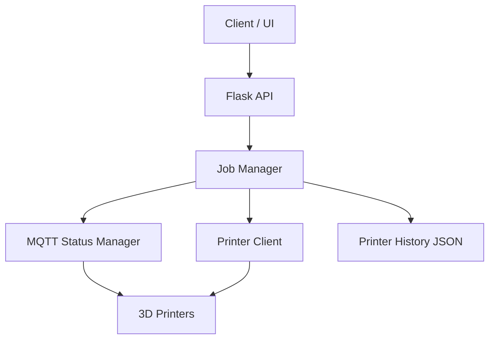

PrintFarm is a service for managing and automating a 3D printer farm.  
It provides an API for starting print jobs, tracking job status, monitoring printer state, and communicating with printers over network protocols.

## Features

- Manage multiple 3D printers
- Start print jobs through an HTTP API
- Track job execution status
- Monitor printer availability and state
- Communicate with printers over MQTT
- Upload print files to devices
- Store printer history and state snapshots

## Project Structure

- app.py — main Flask application and API
- mqtt_manager.py — printer status monitoring through MQTT
- printer_client.py — printer communication logic
- printer_history.py — printer state/history management
- printer_lan.py — LAN communication helpers
- templates/ — HTML templates
- static/ — static files
- printers.yaml — printer configuration
- printer_history.json — saved printer state

## Architecture

## Printer Status Colors

The printer cards use color to show the current device state:

- **Gradient** — the printer has finished a job less than **15 minutes ago**
- **White** — the printer is free and has been idle for more than **15 minutes**
- **Yellow** — the printer is **paused**
- **Blue** — the printer is **offline / powered off**
  

## Tech Stack

- Python
- Flask
- MQTT
- FTPS
- Threading / concurrent job execution
- YAML / JSON for configuration and state storage
- Threading / concurrent job execution
- YAML / JSON for configuration and state storage

