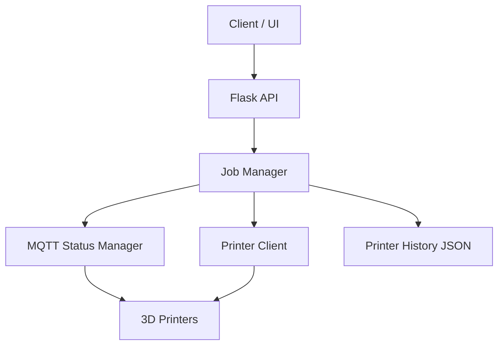
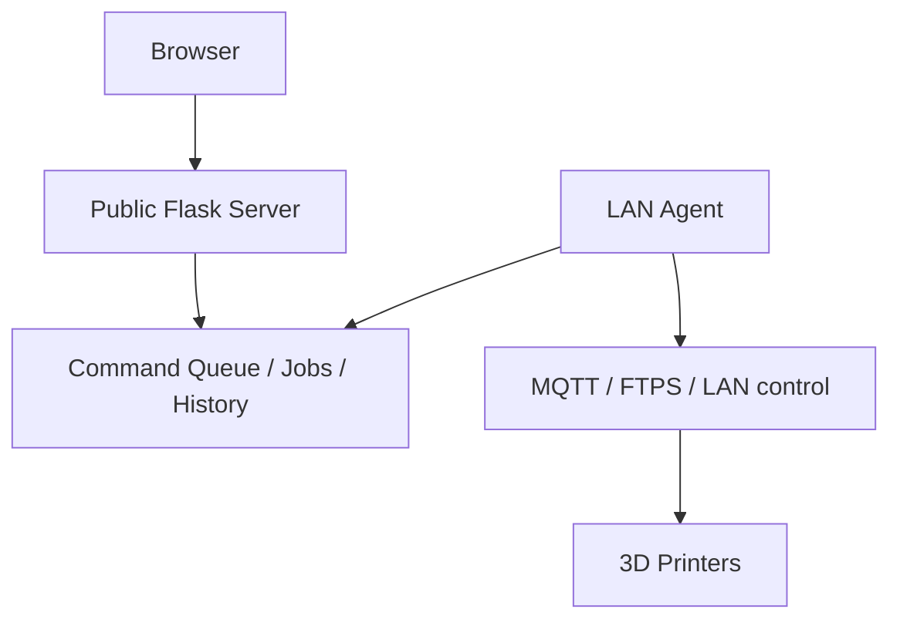

PrintFarm is a service for managing and automating a 3D printer farm.  
It provides an API for starting print jobs, tracking job status, monitoring printer state, and communicating with printers over network protocols.

The project now supports a split deployment:

- `app.py` on the public server
- `agent.py` on a LAN computer that can reach the printers directly

## Features

- Manage multiple 3D printers
- Start print jobs through an HTTP API
- Track job execution status
- Monitor printer availability and state
- Communicate with printers over MQTT
- Upload print files to devices
- Store printer history and state snapshots

## Project Structure

- app.py — main Flask application and API
- mqtt_manager.py — printer status monitoring through MQTT
- printer_client.py — printer communication logic
- printer_history.py — printer state/history management
- printer_lan.py — LAN communication helpers
- templates/ — HTML templates
- static/ — static files
- printers.yaml — printer configuration
- printer_history.json — saved printer state

## Architecture

### Standalone mode

This is the original single-host mode where one process serves the UI and talks to printers directly.

### Split server + agent mode

Use this mode when the website is published on a server in another network, while the printers stay reachable only from a local LAN computer.

Flow:

- the browser sends actions to the public server
- the public server stores commands and uploaded files
- `agent.py` polls the server for commands
- `agent.py` downloads job files and executes LAN actions on printers
- `agent.py` pushes printer statuses back to the server
- the UI keeps reading `/api/status` and `/api/jobs/<id>` from the public server

## Deployment split

### What stays on the public server

- `app.py`
- `templates/`
- `static/`
- `maintenance_db.py`, `maintenance_service.py`, `maintenance_models.py`
- `printer_history.py`
- `file_weight_store.py`
- uploaded job files in `jobs/`
- queued remote commands in `remote_state/`
- a sanitized `printers.yaml` without printer secrets

Use `printers.server.example.yaml` as the template for the server copy.

### What stays on the LAN computer

- `agent.py`
- `mqtt_manager.py`
- `printer_lan.py`
- `printer_client.py`
- full `printers.yaml` with `ip`, `serial`, `access_code`
- local download cache in `agent_jobs/`

Use `printers.agent.example.yaml` as the template for the LAN copy.

### What must be sent from the LAN computer to the server

- printer statuses
- offline/online state
- progress, layers, temperatures, active file name
- results of queued commands
- job progress stages like `uploading`, `uploaded`, `starting`, `started`, `error`

### What must NOT be sent to the public server

- printer LAN IPs
- `serial`
- `access_code`
- any direct LAN credentials

If you want the server to keep showing a printer as available without storing secrets, add `configured: true` in the server-side `printers.yaml`.

## Environment variables

### Server

See `.env.server.example`.

- `PRINTFARM_ROLE=server` switches `app.py` into remote-command mode
- `PRINTFARM_AGENT_TOKEN` is the shared bearer token used by the LAN agent

### Agent

See `.env.agent.example`.

- `PRINTFARM_SERVER_URL` is the public base URL of the server
- `PRINTFARM_AGENT_ID` is the LAN agent identifier
- `PRINTFARM_AGENT_TOKEN` must match the server token
- `PRINTFARM_AGENT_POLL_INTERVAL_SEC` controls command polling
- `PRINTFARM_AGENT_STATUS_PUSH_INTERVAL_SEC` controls status sync
- `PRINTFARM_AGENT_COMMAND_WORKERS` limits concurrent printer jobs
## Printer Status Colors

The printer cards use color to show the current device state:

- **Gradient** — the printer has finished a job less than **15 minutes ago**
- **White** — the printer is free and has been idle for more than **15 minutes**
- **Yellow** — the printer is **paused**
- **Blue** — the printer is **offline / powered off**
  

## Tech Stack

- Python
- Flask
- MQTT
- FTPS
- Threading / concurrent job execution
- YAML / JSON for configuration and state storage
- Threading / concurrent job execution
- YAML / JSON for configuration and state storage

